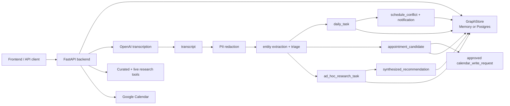

# Caregiver Companion Backend

Caregiver Companion is now a backend-first, transcription-driven care workflow. The active source of truth is caregiver audio/transcript input, not NEHR/demo records or a web frontend.

The backend:

- accepts raw audio and calls OpenAI audio transcription with first-class `auto`, English, Malay/Bahasa, Tamil, Mandarin, and Thai language hints
- stores transcription sessions, original transcripts, and English-normalized text for non-English downstream extraction
- redacts direct PII before downstream extraction, triage, research, guardrail, and synthesis work
- rehydrates local placeholders before returning user-facing task artifacts
- triages transcripts into daily tasks, appointment candidates, and guarded ad hoc research tasks
- checks next-day Google Calendar conflicts for daily tasks
- requires explicit user approval before writing appointments to Google Calendar
- persists graph nodes, edges, and reasoning logs for auditability

## Repository Layout

```text
backend/                 FastAPI backend, graph store, transcription pipeline, tests
backend/sql/schema.sql   Postgres schema for graph nodes, edges, logs, and state
data/                    Curated fallback catalogs for grants, resources, and trajectories
docs/ARCHITECTURE.md     Mermaid architecture diagrams and roadmap validation
docs/API_VERIFICATION.md Manual curl verification and API test coverage
docs/CI_CD.md            Backend CI workflow and testing conventions
docs/DEMO.md             Full demo and live E2E runbook
docs/LEARNING_HARNESS.md Context engineering, model evaluation, and prompt candidate workflow
ROADMAP.md               Backend architecture and implementation phases
```

The previous frontend code has been removed. Current development and verification should target the backend API directly.

## Architecture



Full diagrams and roadmap validation:

```bash
open docs/ARCHITECTURE.md
```

## Setup

Install backend dependencies:

```bash
make install
```

Start the backend:

```bash
make backend
```

The API runs at:

```text
http://127.0.0.1:8000
```

## Environment

Settings are read from the repository root `.env`, then `backend/.env` if present.

Minimum for real transcription:

```bash
OPENAI_API_KEY=...
```

Transcription language defaults to auto-detect. Supported request values are `auto`, `en`, `ms`, `ta`, `zh`, and `th`. Use `POST /transcriptions?language=ms` or `POST /transcribe?language=zh` to override detection. Non-English transcripts preserve the original text and add English-normalized text for the existing extraction pipeline.

Optional:

```bash
DATABASE_URL=...
APP_ENV=development
API_READ_KEY=...
API_WRITE_KEY=...
CLINICIAN_REVIEW_KEY=...
DATA_ENCRYPTION_KEY=...
GOOGLE_CALENDAR_ACCESS_TOKEN=...
GOOGLE_CALENDAR_ID=primary
TINYFISH_API_KEY=...
EXA_API_KEY=...
SEALION_API_KEY=...
SEALION_TRANSCRIPT_REVIEW_ENABLED=true
```

When any API key is configured, patient/caregiver read endpoints require either `X-API-Key` or `X-Clinician-Key`; mutating endpoints require the write key. In `APP_ENV=pilot` or `APP_ENV=production`, `API_READ_KEY`, `API_WRITE_KEY`, and `DATA_ENCRYPTION_KEY` are required at startup. `GET /health` stays public and intentionally returns only a minimal service status.

When `DATA_ENCRYPTION_KEY` is set, sensitive persisted fields such as raw transcripts, normalized transcripts, placeholder maps, calendar payloads, and provider errors are encrypted at rest. Normal API responses redact raw transcript fields and placeholder maps.

Without `DATABASE_URL`, the backend uses an in-memory graph store. Server reloads clear in-memory sessions.

When `SEALION_TRANSCRIPT_REVIEW_ENABLED=true`, the backend sends only redacted text and redacted artifacts to SEA-LION. It stores review/localization outputs as graph review nodes and optional localized display payloads; SEA-LION flags do not overwrite canonical transcript, extraction, or research data.

## Useful Commands

Run backend:

```bash
make backend
```

Run tests:

```bash
make test
```

Run the bounded robustness loop used for frontend-readiness checks:

```bash
make robustness-loop
```

Run the full explicit backend suite:

```bash
TINYFISH_API_KEY= SEALION_API_KEY= backend/.venv/bin/python -m pytest backend/tests
```

CI/CD notes:

```bash
open docs/CI_CD.md
```

Learning harness notes:

```bash
open docs/LEARNING_HARNESS.md
```

Full demo and live E2E runbook:

```bash
open docs/DEMO.md
```

Health check:

```bash
curl -s http://127.0.0.1:8000/health | jq
```

Manual API verification:

```bash
open docs/API_VERIFICATION.md
```

## Current API Surface

Core transcript-first endpoints:

- `POST /transcriptions`
- `POST /transcriptions/{session_id}/process`
- `POST /transcripts/{transcript_id}/redact`
- `POST /transcripts/{transcript_id}/process`
- `GET /tasks/daily`
- `PATCH /tasks/daily/{task_id}`
- `POST /scheduler/next-day-check`
- `GET /research/tasks`
- `POST /research/tasks/{task_id}/run`
- `GET /recommendations`
- `POST /appointments/{appointment_id}/approve-calendar-write`
- `GET /notifications`
- `GET /audit`
- `POST /privacy/consents`
- `POST /privacy/requests`
- `POST /privacy/incidents`
- `POST /privacy/retention/purge`

Legacy NEHR/demo routes and raw NEHR storage have been removed. The active runtime flow starts from caregiver transcripts.
