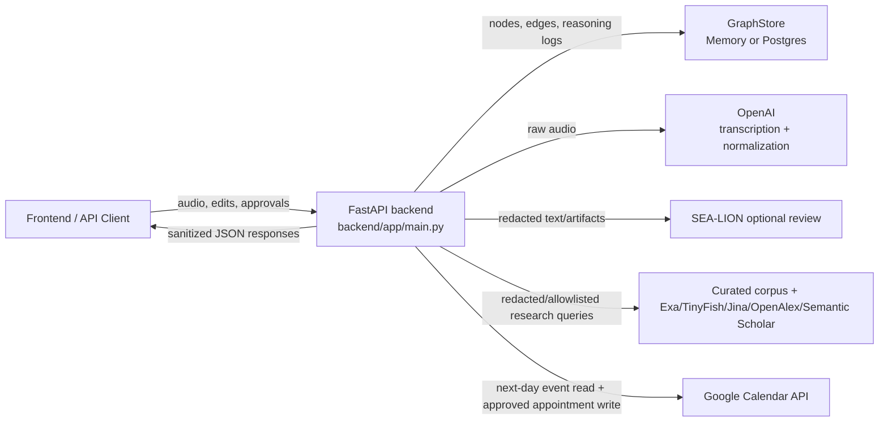
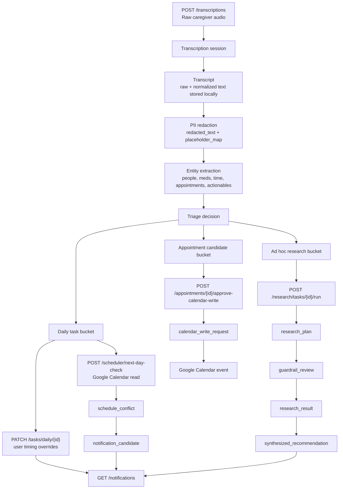
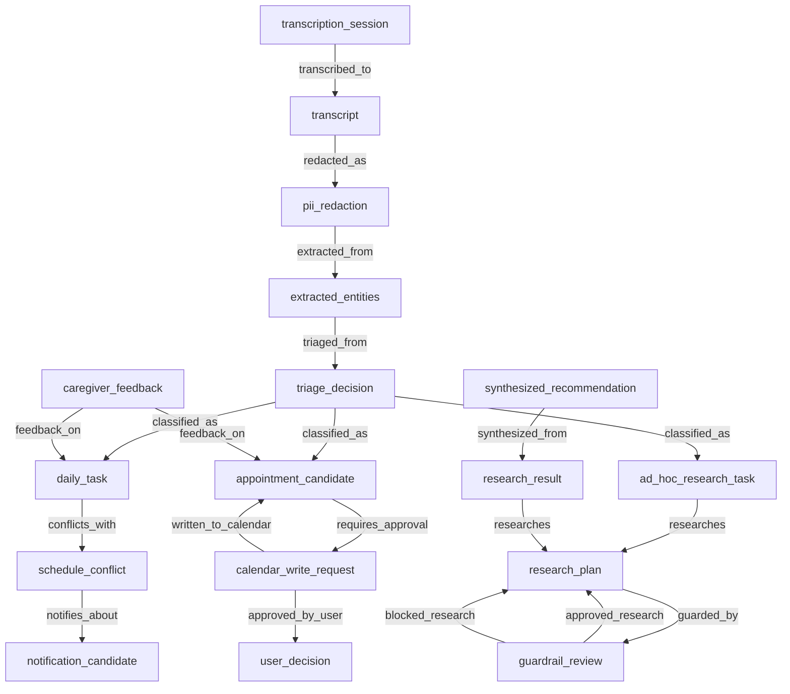
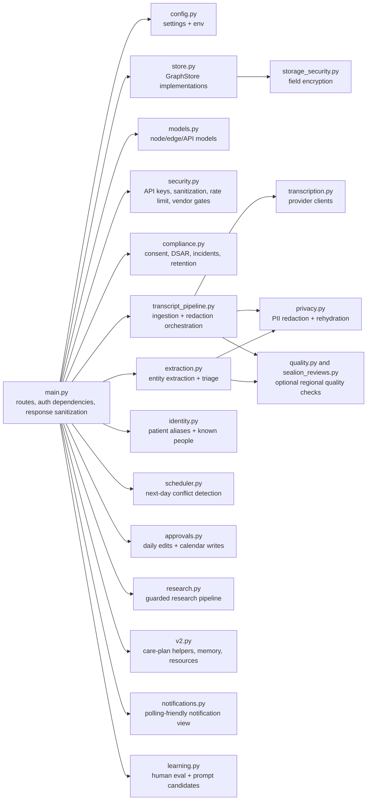
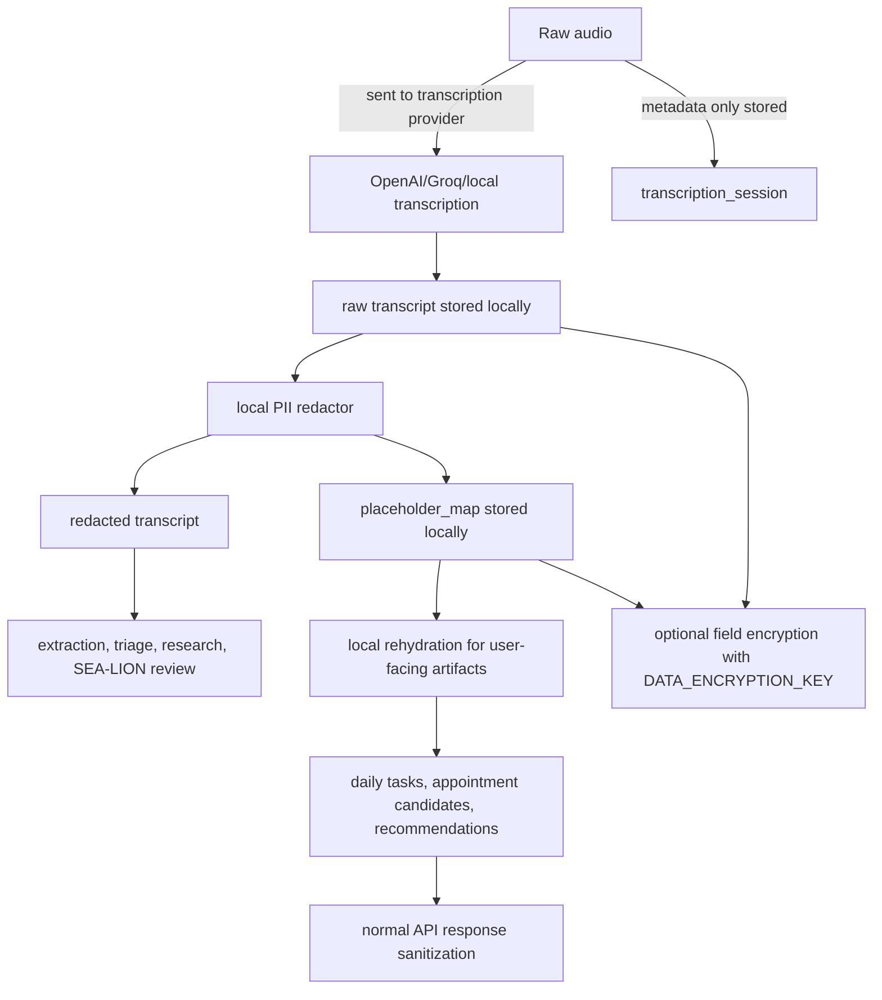

# Backend Architecture

This repository is a backend-first, transcript-driven caregiver workflow. The API accepts caregiver audio, stores transcript artifacts, redacts direct PII before downstream processing, triages each transcript into care buckets, and persists every artifact as graph nodes and edges for auditability.

## System Context



## End-To-End Flow



## Graph Lineage



## Module Map



## Data Protection Boundary



## External Integrations

| Integration | Current Use | Data Sent | Gate/Setting |
| --- | --- | --- | --- |
| OpenAI transcription | `POST /transcriptions` and `/transcribe` | Raw audio | `OPENAI_API_KEY`, `TRANSCRIPTION_PROVIDER=openai`, `VENDOR_OPENAI_ENABLED` |
| OpenAI normalization/search verification | Non-English normalization, optional live result verification | Transcript text for normalization; redacted query/results for verification | `OPENAI_API_KEY`, `LIVE_SEARCH_LLM_VERIFICATION` |
| SEA-LION | Optional transcript/artifact review and localization | Redacted transcript/artifact summaries | `SEALION_API_KEY`, `SEALION_TRANSCRIPT_REVIEW_ENABLED`, `VENDOR_SEALION_ENABLED` |
| Google Calendar read | Next-day conflict detection | Next-day time window only | `GOOGLE_CALENDAR_ACCESS_TOKEN`, `GOOGLE_CALENDAR_ID`, `VENDOR_GOOGLE_CALENDAR_ENABLED` |
| Google Calendar write | Approved appointment candidate insert | Appointment summary/date/time/location/description | Explicit `/appointments/{id}/approve-calendar-write` call |
| Exa/TinyFish/Jina/OpenAlex/Semantic Scholar | Guarded research | Redacted/allowlisted research queries and URLs | Vendor API keys and `VENDOR_*_ENABLED` |

## Roadmap Validation

Status as of May 10, 2026:

| Roadmap Area | Status | Evidence |
| --- | --- | --- |
| Product pivot to transcription-first backend | Done | README states backend-first transcript source of truth; frontend removed. |
| Phase 1 graph foundation | Done | `models.py` and `schema.sql` include transcript-first node/edge types. |
| Phase 2 NEHR/demo runtime removal | Done | Legacy demo routes, raw NEHR storage, scripted demo agent modules, and demo fixtures were physically removed. |
| Phase 3 transcription-first ingestion | Done | `transcription.py`, `transcript_pipeline.py`, `/transcriptions`, `/transcribe`, multilingual normalization, graph persistence. |
| Direct PII redaction and local rehydration | Done | `privacy.py`, `transcript_pipeline.py`, `extraction.py`; downstream work uses redacted text and user-facing artifacts are locally rehydrated. |
| Phase 4 extraction and triage | Done | `extraction.py` creates `extracted_entities`, `triage_decision`, `daily_task`, `appointment_candidate`, and `ad_hoc_research_task`; tests cover simple and multi-bucket transcripts. |
| Daily task scheduling semantics | Done | `approvals.py` supports timing/fixed/movable overrides; `scheduler.py` classifies fixed/movable/unsafe conflicts and medication spacing. |
| Google Calendar next-day read | Done | `scheduler.py` reads only the next-day window through `GoogleCalendarProvider`. |
| Daily 10pm Singapore job | Mostly done | The scheduler has an in-process loop and external cron endpoint with idempotent run state; deployed production still needs platform-level cron configuration. |
| Appointment approval before calendar write | Done | `approvals.py` creates `user_decision`, `calendar_write_request`, and writes only after `/appointments/{id}/approve-calendar-write`. |
| Push notification first step | Done for polling | `notification_candidate` nodes and `GET /notifications` exist. Real push provider/SSE/WebSocket are intentionally not implemented. |
| Phase 6 guarded research pipeline | Done | `research.py` plans, guardrails, runs curated/live adapters, classifies source tiers, and synthesizes recommendations. |
| Research source policy | Done | Official/high-trust/informal tiers and claim statuses are implemented in `research.py`; curated corpus is used before live tools. |
| Reasoning logs and auditability | Mostly done | Reasoning logs cover transcription, redaction, scheduling, research, and reviews. Some roadmap log ideals are not explicit because extraction/triage are deterministic rather than prompt-model calls. |
| API surface draft | Done and expanded | Draft endpoints exist; additional identity, privacy, learning, audit, and evaluation endpoints were added. |
| Evaluation plan | Mostly done | Unit/API/E2E tests cover all core eval cases; live Google Calendar full flow remains manual with real tokens. |
| Compliance/security hardening | Added beyond roadmap | Auth, response sanitization, encryption-at-rest option, consent/DSAR/incidents/retention, and vendor gates exist. |

Summary: the roadmap phases are implemented for demo and backend MVP purposes. The main remaining production gaps are enabling real Google OAuth in deployment, platform cron configuration, and broader conflict semantics beyond daily tasks and appointments.

## Test Entry Points

```bash
# Full deterministic demo flow through all three buckets.
backend/.venv/bin/python -m pytest backend/tests/test_full_backend_e2e.py -q

# Full default backend suite.
TINYFISH_API_KEY= SEALION_API_KEY= backend/.venv/bin/python -m pytest backend/tests -q
```
