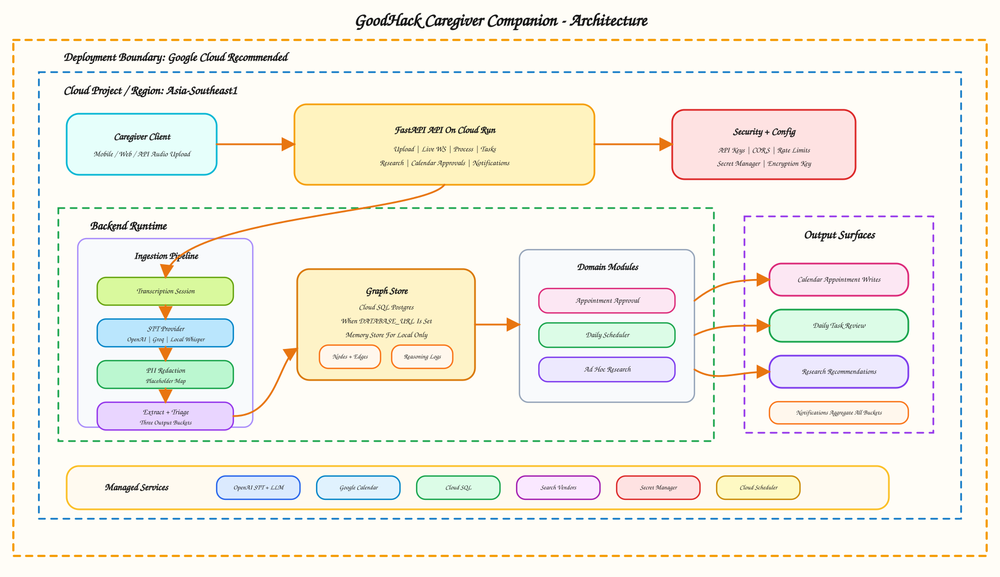
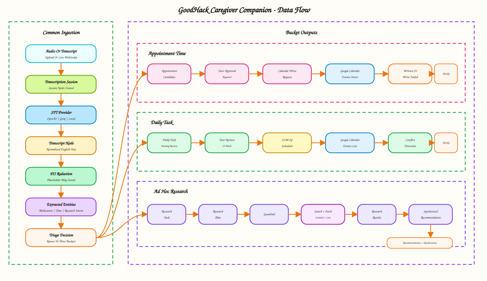

# Project Architecture And Data Flow

Verified: 2026-05-10.

## Scope

This document covers the current backend repository. No production frontend is present in repo. The source of truth is caregiver audio or transcript input, converted into three output buckets:

- Google Calendar appointment candidates.
- Daily task scheduling/review and next-day conflict checks.
- Ad hoc research tasks and recommendations.

## Architecture

## Core Components

| Component | File | Role |
|---|---|---|
| API app | `backend/app/main.py` | Routes, startup, auth dependency wiring, scheduler startup. |
| Config | `backend/app/config.py` | Env-driven vendor keys, model defaults, scheduler, Google Calendar settings. |
| Store | `backend/app/store.py` | Graph abstraction with memory and Postgres implementations. |
| Schema | `backend/sql/schema.sql` | Nodes, edges, reasoning logs, provenance, indexes. |
| Transcription | `backend/app/transcription.py` | OpenAI/Groq/local transcription and normalization. |
| Transcript pipeline | `backend/app/transcript_pipeline.py` | Session node creation, transcript node creation, redaction node creation. |
| Privacy | `backend/app/privacy.py` | PII placeholder mapping and local rehydration. |
| Extraction | `backend/app/extraction.py` | Entity extraction, triage, task/candidate node creation. |
| Scheduler | `backend/app/scheduler.py` | Next-day calendar read, conflict detection, notification candidate creation. |
| Approvals | `backend/app/approvals.py` | Daily patching and approved Google Calendar writes. |
| Research | `backend/app/research.py` | Planning, guardrails, search/fetch/extract/synthesis. |
| Notifications | `backend/app/notifications.py` | User-facing notification aggregation. |
| Compliance | `backend/app/compliance.py` | Consent, processing activity, retention purge. |

## Graph Model

Key node types:

- `transcription_session`
- `transcript`
- `pii_redaction`
- `extracted_entities`
- `triage_decision`
- `daily_task`
- `appointment_candidate`
- `ad_hoc_research_task`
- `research_plan`
- `guardrail_review`
- `research_result`
- `synthesized_recommendation`
- `schedule_conflict`
- `notification_candidate`
- `calendar_write_request`
- `user_decision`

Key edge types:

- `transcribed_to`
- `redacted_as`
- `classified_as`
- `scheduled_from`
- `generated`
- `requires_approval`
- `approved_as`
- `wrote_to_calendar`

## End-To-End Data Flow

## Appointment Flow

1. Transcript extraction identifies date/time/location intent.
2. `appointment_candidate` is created with `requires_calendar_write`.
3. User explicitly approves.
4. `user_decision` and `calendar_write_request` nodes are created.
5. Google Calendar `events.insert` is called.
6. Candidate status becomes written or failed.
7. Notification output reflects write status.

Important constraint: appointments write to Google Calendar only after user approval.

## Daily Task Flow

1. Extraction identifies actionable care instruction.
2. `daily_task` is created.
3. User can review/patch task state.
4. Scheduled check reads next-day Google Calendar events.
5. Conflict detector compares task timing to appointments.
6. `schedule_conflict` and `notification_candidate` are created when needed.

Important constraint: daily tasks are not written to Google Calendar in current code.

## Ad Hoc Research Flow

1. Extraction identifies explicit research intent.
2. `ad_hoc_research_task` is created.
3. Research pipeline creates `research_plan`.
4. Guardrail blocks simple daily instructions and low-basis medical queries.
5. Search uses curated local corpus and optional live providers.
6. Fetched pages are extracted with OpenAI when configured, otherwise local fallback.
7. `research_result` nodes feed `synthesized_recommendation`.
8. Recommendation is returned through `/recommendations` and `/notifications`.

Important constraint: live research depends on vendor keys and vendor allow-list settings.

## Output Surfaces

| Output | Endpoint | Backing nodes |
|---|---|---|
| Notifications | `GET /notifications` | `notification_candidate`, daily/research/calendar status nodes |
| Daily tasks | `GET /tasks/daily` | `daily_task` |
| Daily task patch | `PATCH /tasks/daily/{task_id}` | `daily_task` |
| Scheduler check | `POST /scheduler/next-day-check` | `daily_task`, `schedule_conflict`, `notification_candidate` |
| Research tasks | `GET /research/tasks` | `ad_hoc_research_task` |
| Run research | `POST /research/tasks/{task_id}/run` | `research_plan`, `guardrail_review`, `research_result`, `synthesized_recommendation` |
| Recommendations | `GET /recommendations` | `synthesized_recommendation` |
| Calendar approval | `POST /appointments/{appointment_id}/approve-calendar-write` | `appointment_candidate`, `user_decision`, `calendar_write_request` |

## Deployment-Relevant Architecture Notes

- Memory store is suitable only for local/demo use.
- Postgres is required for durable graph lineage.
- In-process scheduler is acceptable for local runs; use external Cloud Scheduler for serverless production. `[Inference]`
- Research should become an async worker at growth scale. `[Inference]`
- Google Calendar multi-user support needs proper OAuth refresh-token flow. `[Inference]`
